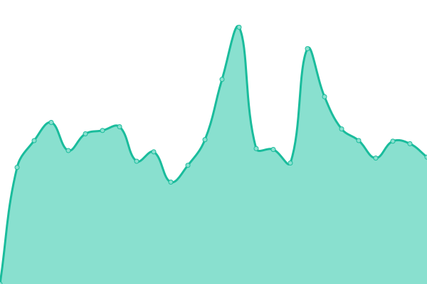
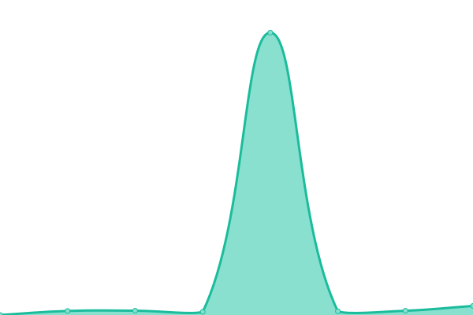

# [📈 Live Status](https://demo.upptime.js.org): <!--live status--> **🟧 Partial outage**

This repository contains the open-source uptime monitor and status page for [saltbo](https://saltbo.cn), powered by [Upptime](https://github.com/upptime/upptime).

With [Upptime](https://upptime.js.org), you can get your own unlimited and free uptime monitor and status page, powered entirely by a GitHub repository. We use [Issues](https://github.com/saltbo/status/issues) as incident reports, [Actions](https://github.com/saltbo/status/actions) as uptime monitors, and [Pages](https://demo.upptime.js.org) for the status page.

<!--start: status pages-->
<!-- This summary is generated by Upptime (https://github.com/upptime/upptime) -->
<!-- Do not edit this manually, your changes will be overwritten -->
<!-- prettier-ignore -->
| URL | Status | History | Response Time | Uptime |
| --- | ------ | ------- | ------------- | ------ |
|  [Blog](https://saltbo.cn) | 🟥 Down | [blog.yml](https://github.com/saltbo/status/commits/HEAD/history/blog.yml) | 

 4917ms
     
 | 

<a href="https://status.saltbo.cn/history/blog">99.85%</a>
    

|  [Disqus](https://disqus.saltbo.cn) | 🟩 Up | [disqus.yml](https://github.com/saltbo/status/commits/HEAD/history/disqus.yml) | 

 971ms
     
 | 

<a href="https://status.saltbo.cn/history/disqus">100.00%</a>
    

|  [Bitwarden](https://bitwarden.saltbo.fun) | 🟩 Up | [bitwarden.yml](https://github.com/saltbo/status/commits/HEAD/history/bitwarden.yml) | 

 3252ms
     
 | 

<a href="https://status.saltbo.cn/history/bitwarden">99.58%</a>
    

|  [Google](https://www.google.com) | 🟩 Up | [google.yml](https://github.com/saltbo/status/commits/HEAD/history/google.yml) | 

 81ms
     
 | 

<a href="https://status.saltbo.cn/history/google">100.00%</a>
    

<!--end: status pages-->

[**Visit our status website →**](https://demo.upptime.js.org)

## 📄 License

- Powered by: [Upptime](https://github.com/upptime/upptime)
- Code: [MIT](./LICENSE) © [saltbo](https://saltbo.cn)
- Data in the `./history` directory: [Open Database License](https://opendatacommons.org/licenses/odbl/1-0/)
